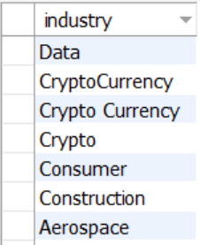

# Layoffs Data Cleaning Project

SQL project to clean and prepare layoffs data for analysis.

## 🧹 Key Cleaning Steps
1. **Removed duplicates**:
   - using `ROW_NUMBER()` window function  
3. **Standardized text data**:  
   - Trimmed whitespace from company names  
   - Consolidated "crypto%" variations to "crypto"  
4. **Fixed NULL values**:  
   - Populated missing industries by joining same-company records  
5. **Date formatting**:  
   - Converted text dates to DATE type using `str_to_date()`

## 📷 Visual Examples (Before & After)         

<h3>📷 Visual Examples (Before vs After)</h3>

<table>
  <tr>
    <th>Before</th>
    <th>After</th>
  </tr>

  <tr>
    <td align="center">
       
      <em>Before: Rows with null values</em>
    </td>
    <td align="center">
       
      <em>After: Null values handled</em>
    </td>
  </tr>

  <tr>
    <td align="center">
       
      <em>Before: Duplicate records</em>
    </td>
    <td align="center">
       
      <em>After: Duplicates removed</em>
    </td>
  </tr>

  <tr>
    <td align="center">
       
      <em>Before: Inconsistent formatting</em>
    </td>
    <td align="center">
       
      <em>After: Standardized formatting</em>
    </td>
  </tr>
</table>

## 🚀 How to Use
1. Run `SQL(11).sql` in MySQL Workbench  
2. View results in `output`📄 folder:  
   - [cleaned_sample.csv](output/cleaned_sample.csv)   (5-row data preview)  
   - [cleaning_stats.txt](output/cleaning_stats.txt) (cleaning summary)  

## 💡 Skills Demonstrated
- Advanced SQL data cleaning  
- Handling NULLs/duplicates  
- Data standardization  
- Date formatting

## 📁 Data Source

- [Download Layoffs_Dataset (Excel)](Layoffs_Dataset.xlsx)📄 
This dataset includes information about Layoffing of employees in companies over 3 years (2020-2023)
